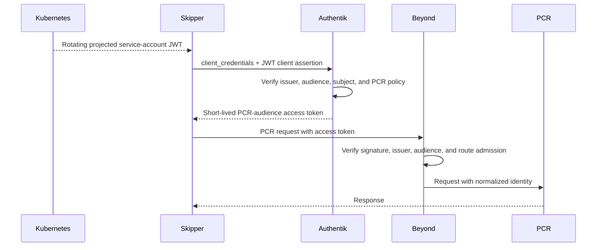

# Machine identity and scoped credentials

Status: proposal

Date: 2026-09-15

## Decision summary

Beyond should stop treating every non-browser caller as the same kind of
"machine client."

- Workloads with an external identity, beginning with Skipper in Kubernetes,
  should authenticate to Authentik with a short-lived federated workload JWT.
  The JWT is the client credential used in an OAuth `client_credentials`
  exchange; it replaces a stored OAuth client secret or Authentik app password.
- Authentik should issue an access token for one explicit resource audience.
  The workload must reuse that token until it expires instead of exchanging its
  credential for every resource request.
- Beyond should verify the Authentik token's signature, issuer, audience, and
  identity claims, apply the configured route admission policy, remove
  untrusted inbound identity headers, and inject normalized identity headers.
- Human-operated clients that can perform OAuth should use an interactive
  authorization flow. A Kubernetes service account is not a substitute for a
  human identity.
- Clients whose protocol accepts only one static API-key-shaped string remain
  a separate compatibility problem. The workload-identity migration must not
  force those clients into an inappropriate machine identity.

This design does not make Grafana roles a general authorization primitive.
`grafana_role_projection` remains an optional adapter on Grafana routes only.

## Why this change

Beyond's current `credential_auth` flow sends an Authentik username and app
password to the OAuth token endpoint on every request. Authentik verifies the
credential and application policy, issues a JWT, records a login event, and
Beyond immediately discards the JWT after reading its identity claims.

During the 30 days examined on 2026-09-15, this produced approximately:

- 1.417 million successful credential validations;
- 7.09 million Authentik event task rows from those validations; and
- approximately 97,000 monthly task rows from the rest of Authentik's normal
  event and scheduled-task workload.

Each successful exchange currently fans out to one event dispatcher and four
notification-rule handlers. Authentik 2026.8 makes purging this history safer,
but it does not make per-resource-request token issuance a sound protocol.

Caching an issued token until its five- or ten-minute expiry would reduce the
load substantially, but the modeled three-replica result is still about
108,000 exchanges and 541,000 task rows per month. That is useful containment,
not the desired end state. This model uses the observed traffic across 68
credential identifiers; it is not an estimate for one continuously active
workload.

The earlier suggestion of a 30-second credential cache was not derived from
OAuth. Thirty seconds is the existing Beyond user-status cache lifetime. Token
reuse and revocation freshness are separate controls and must not inherit the
same duration accidentally.

## Responsibility boundaries

### Authentik

Authentik owns:

- trust in external identity issuers;
- validation of a workload JWT;
- application policy at token issuance;
- access-token signing, audience, claims, and lifetime;
- generated or mapped service identities; and
- issuance audit events.

### Beyond

Beyond owns:

- mapping the requested host to a configured resource;
- verifying tokens presented at that resource boundary;
- requiring the exact configured audience for the route;
- applying the route's generic `allowed_groups` admission policy;
- removing caller-supplied `X-Beyond-*` headers;
- injecting normalized verified identity headers; and
- app-specific adapters explicitly configured on that route.

Grafana role projection is one such app-specific adapter. It is not part of the
token contract and must not be propagated to PCR, gateways, Gatekeeper, or
other applications.

### Upstream application

An upstream owns its domain authorization. Examples include PCR deciding which
authenticated identities may create change records and an inference gateway
deciding which models an admitted identity may use. An upstream that trusts
Beyond's identity headers must be unreachable through a path on which callers
can forge those headers.

## Client classes

| Client class | Examples | Preferred authentication |
| --- | --- | --- |
| Kubernetes workload | Skipper calling PCR | Projected service-account JWT exchanged for an Authentik resource token |
| Other OIDC-capable workload | CI with an OIDC issuer | Issuer JWT exchanged for an Authentik resource token |
| Human-operated OAuth client | Diderot CLI; future gcx support | Authorization code with PKCE, device flow, or an exec credential helper |
| Static-key-only client | OpenAI-compatible SDKs; current stock gcx | Explicitly scoped static credential compatibility path |

The term "M2M" should be reserved for the first two classes. A human app
password carried by a CLI is non-interactive authentication, but it is not a
workload identity.

## Federated workload flow

The first implementation target is Skipper calling PCR.



The token request is conceptually:

```http
POST /application/o/token/
Content-Type: application/x-www-form-urlencoded

grant_type=client_credentials&
client_id=pcr-credential-auth&
client_assertion_type=urn:ietf:params:oauth:client-assertion-type:jwt-bearer&
client_assertion=<projected-service-account-jwt>&
scope=openid%20email%20groups
```

For this Authentik flow, `client_id=pcr-credential-auth` selects the PCR OAuth
provider and therefore the access token's PCR-specific `aud`. The requested
scopes select configured output claim mappings; they do not choose the resource
audience. The provider must map the workload identity into the stable claims
Beyond requires, even though that identity represents a service account rather
than a human.

The workload JWT is better than a static client secret; it is not an
alternative OAuth grant. `client_credentials` is the exchange protocol, while
the signed workload JWT is how the client authenticates during that exchange.

The client must cache the Authentik access token and refresh it shortly before
`exp`. Concurrent requests must share one refresh operation. There is no
refresh token in this flow: when the access token expires, the client performs
another assertion exchange using the current projected JWT.

## Kubernetes assertion requirements

Use an explicitly projected service-account token, not the pod's default
Kubernetes API token. The projection must have:

- a dedicated audience accepted by the Authentik integration;
- a short expiration;
- automatic kubelet rotation;
- read access limited to the intended container; and
- an exact service-account subject.

Authentik policy must verify at least:

- the exact EKS OIDC issuer;
- the dedicated assertion audience;
- `exp` and signature validity;
- the expected `system:serviceaccount:<namespace>:<service-account>` subject;
  and
- any cluster or namespace claims needed to prevent an equivalent name in a
  different trust domain from being accepted.

Trusting every correctly signed token from a cluster is not sufficient. The
policy must bind the assertion to the individual workload and target
application.

Authentik validates this assertion offline from the issuer's JWKS; it does not
perform a Kubernetes TokenReview on every exchange. Deleting the service
account or stopping the pod prevents future projection and rotation, but an
assertion already issued remains cryptographically valid until its own `exp`.
An Authentik policy or issuer-trust change is required to reject it sooner.

Authentik's OAuth source mappings must produce stable output identity claims
that Beyond can normalize. They must not create a new logical user every time
the projected token rotates.

## Resource audiences and route scope

Every machine token must name one resource audience. Beyond configuration must
fail closed when the route has no exact audience match.

The names below are logical resource names. On the wire, Authentik currently
uses the OAuth provider's client ID as the JWT `aud`; the configured value must
still be unique to the resource and matched exactly by Beyond.

| Resource boundary | Intended audience/scope | Initial callers |
| --- | --- | --- |
| Grafana | `grafana` | gcx and approved Grafana automation |
| PCR | `pcr` | Skipper and approved PCR clients |
| Inference gateway family | `gateway` | Intentionally shared gateway and collector endpoints |
| Gatekeeper | `gatekeeper` | Gatekeeper-specific clients only |

Sharing `gateway` across several hostnames is an explicit policy decision, not
a wildcard. Each accepted hostname must enumerate that audience. A token for
Grafana, PCR, or Gatekeeper must fail on every gateway-family route, and the
reverse must also fail.

OAuth provider grant types should be restricted to the flows actually used.
Pure machine providers should allow only `client_credentials`. This prevents
unused browser, implicit, password, device, and refresh-token flows, but it
does not by itself scope an Authentik app password.

## PCR migration shape

PCR is the best pilot because it has a concrete in-cluster service identity and
its OAuth provider is already restricted to `client_credentials`.

The current PCR hostname accepts browser sessions and Authentik app passwords.
Beyond currently forbids `credential_auth` and `bearer_auth` on the same
application because both can claim an `Authorization: Bearer` value. The pilot
must therefore choose one of these migrations deliberately:

1. Add a dedicated machine hostname using `bearer_auth`, pointing to the same
   PCR upstream. This is the preferred low-coupling pilot because it does not
   disturb browser sessions or existing PCR CLI credentials.
2. Replace `credential_auth` on the existing hostname after every static-key
   caller has migrated.
3. Add protocol-aware dual dispatch to Beyond. Do this only if a durable use
   case justifies the additional parser and downgrade-safety surface.

A separate hostname is a resource boundary, not a new PCR authorization model.
Both paths remain subject to the same upstream network-policy and trusted-header
requirements.

## Token lifetime and task volume

The output access-token lifetime determines both the maximum time an already
issued token survives workload revocation and how often Authentik records an
issuance event.

For one continuously active workload over 30 days:

| Access-token lifetime | Exchanges | Current event task rows |
| --- | ---: | ---: |
| 5 minutes | 8,640 | 43,200 |
| 15 minutes | 2,880 | 14,400 |
| 1 hour | 720 | 3,600 |

Choose the lifetime from an explicit revocation objective, not from the old
30-second user cache. Removing Authentik trust or changing issuance policy
prevents the next exchange. Deleting a Kubernetes service account prevents new
assertions but does not invalidate one already projected. Without an additional
revocation mechanism, the worst-case window after workload removal is the
remaining assertion lifetime plus the lifetime of an Authentik access token
minted just before that assertion expires.

The client should refresh before expiry with jitter and singleflight. It must
not retry an invalid assertion indefinitely, and it must bound retries for an
unavailable Authentik endpoint.

## Static credential exception

Projected workload identity does not solve authentication for clients that
accept only one static API-key-shaped string. These clients should not block
the workload migration, and their compatibility mechanism must not become the
default for real workloads.

Authentik app passwords are user-global. A purpose in the token identifier is
useful for inventory and independent revocation but is not an authorization
boundary. Separate OAuth providers restrict the access token that Authentik
issues; they do not restrict which of the user's app passwords can request it.

The remaining choices should be evaluated separately:

- retain app passwords temporarily and cache successful exchanges until the
  issued token expires;
- have Beyond mint a signed, resource-scoped handle backed by Authentik's user
  and token lifecycle without adding a Beyond credential database; or
- pursue an upstream Authentik feature that binds an app-password token to
  allowed providers or audiences.

An Authentik expression policy that re-queries the raw submitted password and
infers security from a user-controlled token identifier is not a preferred
solution. It depends on internal models and credential-bearing request data,
and it turns bookkeeping text into a fragile authorization protocol.

No static-key design may propagate Grafana roles as a generic claim. It should
carry an explicit audience or resource scope; application-specific projection
continues to happen only at the configured route.

## Migration plan

1. Inventory every caller currently using `credential_auth`, classifying it as
   a workload, human OAuth client, or static-key-only client.
2. Pilot projected workload identity with Skipper and a PCR machine hostname.
3. Configure Authentik to trust the EKS issuer and bind the exact Skipper
   service-account assertion to PCR token issuance.
4. Add assertion exchange, expiry-aware caching, bounded refresh, and metrics
   to Skipper.
5. Configure Beyond `bearer_auth` for the PCR machine route and verify exact
   PCR audience enforcement plus identity-header normalization.
6. Remove Skipper's app password only after positive and negative acceptance
   tests pass and the rollback window closes.
7. Migrate other in-cluster workload callers one resource at a time.
8. Restrict each machine OAuth provider to the grants it actually needs.
9. Design and migrate the static-key-only exception separately.

## Acceptance criteria for the PCR pilot

- A projected token from the exact Skipper service account can obtain a PCR
  access token.
- A token from another namespace, service account, cluster, or audience cannot.
- The PCR access token works only on the PCR machine route.
- Grafana, gateway, Gatekeeper, and browser tokens fail on the PCR machine
  route, and a PCR token fails on their routes.
- Beyond injects only normalized generic identity headers; no Grafana role
  header appears.
- Skipper reuses one access token until its refresh window rather than
  exchanging once per PCR request.
- Authentik unavailability does not cause unbounded retries or a token-exchange
  stampede.
- An Authentik policy denial prevents the next refresh. After Kubernetes
  workload removal, refresh fails once the last projected assertion expires,
  and the observed end-to-end window matches the documented revocation
  objective.
- PCR remains unreachable through a path that permits forged identity headers.
- Metrics distinguish assertion exchange, cached-token use, refresh failure,
  JWT verification failure, audience rejection, and route-policy denial without
  including token material.

## Open decisions

- The PCR machine hostname and whether it is temporary or permanent.
- The PCR access-token lifetime and corresponding revocation objective.
- The stable Authentik service identity and claim mapping for a Kubernetes
  subject.
- Whether PCR should independently verify the Authentik access token in
  addition to trusting Beyond's identity headers.
- Which current Gatekeeper and gateway callers are true workloads.
- The eventual static-key-only credential design.

These decisions do not block restricting unused OAuth grants or building the
PCR workload-identity pilot behind a separate route.
